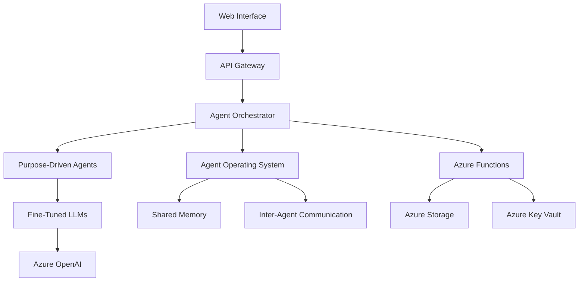

---

## Multi-Layer Architecture and Cloud-Native Integration

---
### Note on Major Refactoring (2025)
BusinessInfinity has undergone a major refactoring and consolidation. All core features (agent orchestration, storage, environment, ML pipeline, MCP, authentication) are now implemented and maintained in the AgentOperatingSystem (AOS) under `RealmOfAgents/AgentOperatingSystem`. BusinessInfinity only contains business-specific logic and orchestrates agents via AOS. See the [README.md](../../README.md) for vision and usage, and [implementation.md](../implementation/implementation.md) for technical details.

**Legacy MVP, migration, and refactoring documentation has been assimilated into this and related docs.**

---

Business Infinity employs a multi-layer architecture that combines modern web interfaces, API gateways, agent orchestration, and cloud-native infrastructure for scalable, reliable business automation.

### High-Level Architecture (Mermaid)


### Core Components
- **Web Interface Layer:** Modern, responsive dashboard for live monitoring, agent management, and analytics
- **API Gateway:** Secure, intelligent routing, authentication, rate limiting, and monitoring
- **Agent Orchestrator:** Multi-agent coordination, task delegation, resource management, and error handling
- **Purpose-Driven Agent Layer:** Specialized agents for operations (Accounts, Finance, HR, Marketing, Engineering, Sales, IT), strategy (Management, BusinessDev), utilities (Legal, Quality, Logistics), and stakeholders (PR)
- **Cloud Services:** Azure Functions, Storage, Key Vault, OpenAI, Cognitive Services, Machine Learning

---

## Perpetual Agent Patterns and Best Practices

BusinessInfinity agents operate as perpetual daemons, continuously monitoring, acting, and learning. Key patterns:
- **Continuous Operational Cycles:** Real-time event processing, proactive issue detection, intelligent alerting, predictive analytics
- **Asynchronous Processing:** Concurrent business process handling using asyncio
- **Daemon-Like Operations:** Boot-time initialization, event-driven response, resource management, health monitoring
- **Always-On Integration:** Persistent Copilot Studio and cloud service integration for collaborative, high-availability automation

**Best Practices:**
- Focus on measurable business outcomes and process mapping
- Implement comprehensive logging, monitoring, and automated testing
- Design for scalability, security, and compliance (encryption, RBAC, audit trails)
- Integrate with ERP, CRM, financial, and communication platforms for end-to-end automation

See implementation documentation for technical details and code examples.
---
# Business Infinity Architecture (Consolidated)

## Overview
Business Infinity is a next-generation, multi-agent boardroom system for business automation, built on the AgentOperatingSystem (AOS). It leverages modular, role-specialized agents (CEO, CFO, CTO, CMO, Founder, Investor) orchestrated via a transparent, auditable Model Context Protocol (MCP) and powered by LoRA adapters for domain expertise. All core features (agent orchestration, storage, environment, ML pipeline, MCP, authentication) are implemented in AOS.

---

## System Architecture

### High-Level Diagram


### Key Layers
- **Frontend (Boardroom):** Chat UI, dashboard (renders MCP-UI schema), demo/training UI (calls host AML APIs)
- **Azure Functions Host App:** MCP-UI module, governance/validation, AML manager, persistence (Azure Table Storage), async processing (Azure Storage Queue), HTTP APIs
- **Semantic Kernel Multi-Agents Layer:** Domain-specific agents bound to AML LoRA adapters (e.g., CMO → Marketing LoRA), orchestrate reasoning/tool use/AML inference, emit events to storage queue
- **Azure Machine Learning (AML):** LoRA adapters per domain, online endpoints, training pipelines, model registry

---

## Manifest and Action Legend
BusinessInfinity uses a manifest-driven approach for UI, agent, and workflow orchestration. The manifest defines roles, scopes, actions, and schema contracts. See [manifest.md](manifest.md) for the full schema and [legend.md](../implementation/legend.md) for action mappings.

---

## Agent Roles and LoRA Mapping
| Role      | Description                                      | Typical LoRA Legend   |
|-----------|--------------------------------------------------|----------------------|
| CEO       | Strategic vision, leadership, growth, final say  | Steve Jobs, Drucker  |
| CFO       | Financial stewardship, capital, cashflow, runway | Warren Buffett       |
| CTO       | Technology direction, IT risk, R&D               | Linus Torvalds       |
| CMO       | Branding, product-market fit, marketing strategy | Phil Knight, Kotler  |
| Founder   | Vision holder, customer empathy, bias to action  | Elon Musk, Simons    |
| Investor  | External capital, market validation, governance  | Buffett, Sand Hill   |

---

## Governance, Validation, and Auditability
- **Governance Layer:** Role/scope/tool checks, policy engine (OPA/Cedar), legend blending, audit logging
- **Validation:** All agent actions and ML/LLM operations are validated via manifest/MCP contracts
- **Auditability:** All decisions, scores, and policy applications are traceable and replayable

---

## Unified Core Features (via AOS)
All core features are imported from AOS:
```python
from RealmOfAgents.AgentOperatingSystem.storage.manager import UnifiedStorageManager
from RealmOfAgents.AgentOperatingSystem.environment import UnifiedEnvManager
from RealmOfAgents.AgentOperatingSystem.ml_pipeline_ops import MLPipelineManager
from RealmOfAgents.AgentOperatingSystem.mcp_servicebus_client import MCPServiceBusClient
from RealmOfAgents.AgentOperatingSystem.aos_auth import UnifiedAuthHandler
```

---

## References
- [manifest.md](manifest.md): Full manifest schema and contract
- [legend.md](../implementation/legend.md): Action legend for manifest-driven orchestration
- [diagrams/](../diagrams/): Referenced architecture diagrams

---


## Unified Core Features and Separation of Concerns

All core features (storage, environment, ML pipeline, MCP, authentication) are now implemented and maintained in the AgentOperatingSystem (AOS) under `RealmOfAgents/AgentOperatingSystem`. BusinessInfinity does not implement or maintain any local versions of these features. All previous local implementations have been removed.

**How to use core features:**
Import all managers and core features from `RealmOfAgents.AgentOperatingSystem`. For example:
```python
from RealmOfAgents.AgentOperatingSystem.storage.manager import UnifiedStorageManager
from RealmOfAgents.AgentOperatingSystem.environment import UnifiedEnvManager
from RealmOfAgents.AgentOperatingSystem.ml_pipeline_ops import MLPipelineManager
from RealmOfAgents.AgentOperatingSystem.mcp_servicebus_client import MCPServiceBusClient
from RealmOfAgents.AgentOperatingSystem.aos_auth import UnifiedAuthHandler
```

See the AOS documentation for more details on each feature and API.

**Separation of Concerns:**
- AOS: All agent orchestration, resource management, storage, environment, ML pipeline, MCP, and authentication logic
- BI: Business logic, user interface, and orchestration of agents via AOS

**Note:** All legacy code, MVP, and migration documentation have been assimilated. For historical MVP requirements and migration details, see the appendix in [implementation.md](../implementation/implementation.md).

---

## Azure Service Bus and MCP Migration
BusinessInfinity now uses Azure Service Bus for all MCP (Model Context Protocol) communication with external systems via the AOS MCP client. See [AZURE_SERVICE_BUS.md](../../AZURE_SERVICE_BUS.md) and [MCP_CLIENT_MIGRATION.md](../../MCP_CLIENT_MIGRATION.md) for environment variables and migration notes. All direct MCP handler code has been removed from BusinessInfinity; only the AOS MCP client is used for external MCP calls.