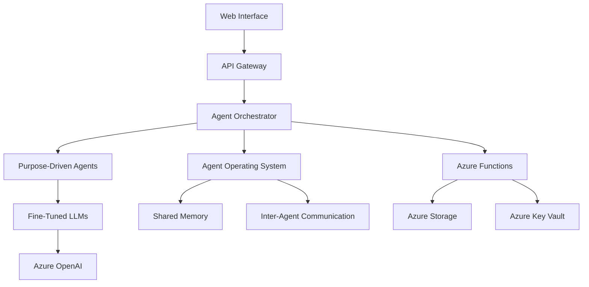

# Business Infinity Architecture

## Overview

Business Infinity employs a sophisticated multi-layer architecture that combines cutting-edge AI frameworks with cloud-native infrastructure to deliver comprehensive business automation. The system is designed for scalability, reliability, and seamless integration across all business functions.

## System Architecture

### High-Level Architecture



## Core Components

### 1. Web Interface Layer
- **Frontend Platform**: Modern web application with responsive design
- **Real-time Dashboard**: Live monitoring of all business functions
- **Agent Control Panel**: Configuration and management of AI agents
- **Analytics Interface**: Business intelligence and reporting tools

### 2. API Gateway
- **Request Routing**: Intelligent routing of requests to appropriate services
- **Authentication**: Secure access control and user management
- **Rate Limiting**: Traffic management and resource protection
- **Monitoring**: Comprehensive API usage analytics

### 3. Agent Orchestrator
- **Agent Coordination**: Managing interactions between multiple agents
- **Task Delegation**: Distributing work based on agent specialization
- **Resource Management**: Optimizing computational resources
- **Error Handling**: Robust failure recovery and fault tolerance

### 4. Purpose-Driven Agent Layer

#### Business Operations Agents
- **AccountsAgent**: Financial accounting and reporting automation
- **FinanceAgent**: Financial planning, analysis, and forecasting
- **HRAgent**: Human resources management and employee relations
- **MarketingAgent**: Marketing campaigns, analytics, and customer engagement
- **EngineeringAgent**: Product development and technical operations
- **SalesAgent**: Sales process automation and customer relationship management
- **ITAgent**: Information technology management and support

#### Strategic Business Agents
- **ManagementAgent**: Executive decision support and governance
- **BusinessDevAgent**: Partnership development and strategic initiatives

#### Utility Agents
- **LegalAgent**: Legal compliance, contract management, and risk assessment
- **QualityAgent**: Quality assurance and process improvement
- **LogisticsAgent**: Supply chain optimization and inventory management

#### Stakeholder Agents
- **PRAgent**: Public relations and external communications management

### 5. Agent Operating System (AOS)
- **Agent Teams**: Coordinated groups of specialized agents
- **Perpetual Agents**: Long-running agents maintaining context and continuity
- **Shared Memory System**: Centralized knowledge store for agent collaboration
- **Inter-Agent Communication**: Standardized messaging protocols

### 6. Fine-Tuned LLM Integration
- **Domain-Specific Models**: Specialized AI models for business contexts
- **Technical Domain**: Software development, APIs, system architecture
- **Medical Domain**: Healthcare compliance and protocol management
- **Legal Domain**: Contract analysis and regulatory compliance
- **Financial Domain**: Investment analysis and risk assessment

## Infrastructure Architecture

### Azure Cloud Platform

#### Compute Services
- **Azure Functions**: Serverless compute for scalable agent operations
- **Azure Container Instances**: Containerized agent deployment
- **Azure App Service**: Web application hosting

#### Storage Services
- **Azure Blob Storage**: Document and file storage
- **Azure Table Storage**: Structured data persistence
- **Azure Cosmos DB**: Global distributed database for agent state

#### AI Services
- **Azure OpenAI**: Advanced language model capabilities
- **Azure Cognitive Services**: Additional AI capabilities
- **Azure Machine Learning**: Custom model training and deployment

#### Security Services
- **Azure Key Vault**: Secure credential and secret management
- **Azure Active Directory**: Identity and access management
- **Azure Security Center**: Comprehensive security monitoring

#### Monitoring Services
- **Azure Application Insights**: Application performance monitoring
- **Azure Log Analytics**: Centralized logging and analysis
- **Azure Monitor**: Infrastructure and service monitoring

## Data Flow Architecture

### 1. Request Processing Flow
```
User Request → Web Interface → API Gateway → Agent Orchestrator → Specific Agent → Fine-Tuned LLM → Response Processing → User Interface
```

### 2. Inter-Agent Communication Flow
```
Agent A → Shared Memory → Agent Operating System → Message Queue → Agent B → Action Execution → Result Storage
```

### 3. Knowledge Management Flow
```
External Data → Learning Agents → Knowledge Processing → Shared Memory → Domain-Specific Agents → Business Actions
```

## Security Architecture

### Authentication & Authorization
- **Multi-Factor Authentication**: Enhanced security for user access
- **Role-Based Access Control**: Granular permission management
- **API Key Management**: Secure service-to-service communication

### Data Protection
- **Encryption at Rest**: All stored data is encrypted
- **Encryption in Transit**: Secure communication channels
- **Data Isolation**: Tenant-specific data segregation

### Compliance & Governance
- **Audit Logging**: Comprehensive activity tracking
- **Data Retention Policies**: Automated data lifecycle management
- **Compliance Monitoring**: Continuous compliance validation

## Scalability Architecture

### Horizontal Scaling
- **Agent Pool Management**: Dynamic agent instance scaling
- **Load Balancing**: Intelligent request distribution
- **Auto-scaling**: Automatic resource adjustment based on demand

### Performance Optimization
- **Caching Strategy**: Multi-level caching for improved response times
- **Resource Pooling**: Efficient resource utilization
- **Batch Processing**: Optimized handling of bulk operations

## Integration Architecture

### External System Integration
- **REST APIs**: Standard web service integration
- **Webhooks**: Event-driven integration patterns
- **Message Queues**: Asynchronous communication with external systems

### Business System Connectors
- **ERP Integration**: Enterprise resource planning systems
- **CRM Integration**: Customer relationship management platforms
- **Financial Systems**: Accounting and financial management tools

## Deployment Architecture

### Environment Strategy
- **Development**: Isolated development environment for testing
- **Staging**: Pre-production environment for validation
- **Production**: High-availability production environment

### CI/CD Pipeline
- **Source Control**: Git-based version control
- **Automated Testing**: Comprehensive test suite execution
- **Deployment Automation**: Automated deployment to all environments

### Disaster Recovery
- **Backup Strategy**: Regular automated backups
- **Failover Mechanisms**: Automatic failover to backup systems
- **Recovery Procedures**: Documented recovery processes

## Future Architecture Considerations

### Emerging Technologies
- **Edge Computing**: Distributed processing capabilities
- **Quantum Computing**: Advanced computational capabilities
- **Blockchain Integration**: Secure transaction and audit trails

### AI Advancement Integration
- **Multi-Modal AI**: Integration of vision, audio, and text capabilities
- **Federated Learning**: Distributed machine learning approaches
- **Explainable AI**: Enhanced transparency and interpretability

This architecture ensures Business Infinity remains at the forefront of business automation technology while providing a solid foundation for future growth and innovation.
